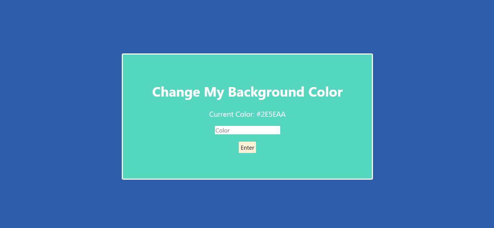
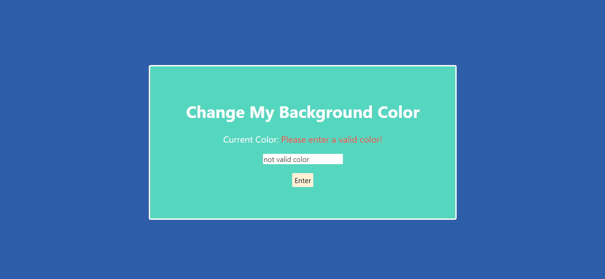
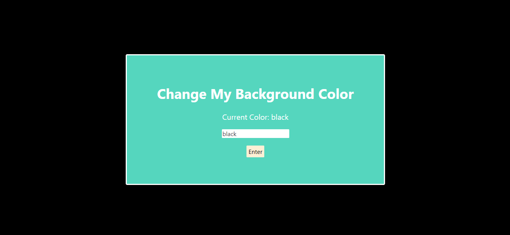

# Change My Background Color

This simple javascript project will allow you to change any background color that you want. But if you enter a not valid color, this will pop up, "Please enter a valid color!". So, please enter a valid color!

# Default Color

# When you enter a not valid color

# When you enter a valid color
